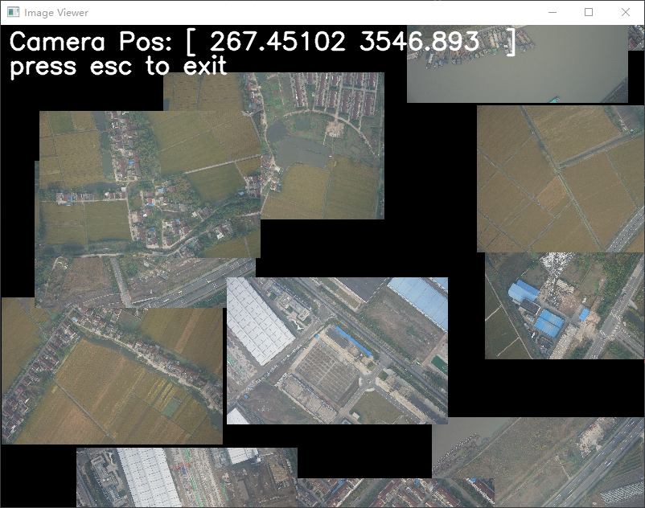

## 无限图像浏览器 使用说明

### 简介
`无限图像浏览器` 是一个基于 OpenCV 的图像查看器，支持图像的动态加载和卸载、拖动视图以及缩放功能。该程序可以加载指定目录下的图像，并在窗口中显示。

### 效果展示


### 依赖
- Python 3.x
- OpenCV 
- NumPy

### 安装依赖
在运行该程序之前，请确保已安装所需的依赖库。可以使用以下命令安装：

```bash
pip install opencv-python numpy
```

### 使用方法

1. **初始化 ImageViewer 对象**

   ```python
   viewer = ImageViewer(window_size=(800, 600), zoom=1.0)
   ```

   - [`window_size`]：窗口大小，默认为 (800, 600)。
   - [`zoom`]：初始缩放比例，默认为 1.0。

2. **添加图像**

   使用 [`add_image`] 方法添加图像及其位置：

   ```python
   viewer.add_image("/path/to/image1.jpg", np.array([0, 0]))
   viewer.add_image("/path/to/image2.jpg", np.array([x, y]))
   ```

   - [`path`]：图像文件路径。
   - [`pos`]：图像在视图中的位置，使用 NumPy 数组表示。

3. **运行查看器**

   使用 [`run`] 方法启动图像查看器：

   ```python
   viewer.run()
   ```

### 示例

以下是一个完整的示例代码：

```python
import os
import random
import numpy as np
from show_img import ImageViewer

if __name__ == "__main__":
    image_dir = '/mnt/d/Dataset/UAV_VisLoc_dataset/03/drone/'

    viewer = ImageViewer()

    # 添加图像及其位置
    viewer.add_image("./imgs/03_0001.JPG", np.array([0, 0]))
    viewer.add_image("./imgs/03_0002.JPG", np.array([-19.02805901*9, -98.53948212*9]))
    viewer.add_image("./imgs/03_0003.JPG", np.array([1000, -1000]))
    viewer.add_image("./imgs/03_0004.JPG", np.array([-10000, -1000]))

    # 运行查看器
    viewer.run()
```

### 功能说明

- **拖动视图**：按住鼠标左键并移动鼠标可以拖动视图。
- **缩放视图**：使用鼠标滚轮可以缩放视图。
- **退出程序**：按下 `ESC` 键可以退出程序。

### 代码结构

- [`ImageViewer`] 类：主要的图像查看器类，包含初始化、鼠标事件处理、图像加载和渲染等功能。
- [`mouse_callback`] 方法：处理鼠标事件，包括拖动和缩放。
- [`add_image`] 方法：添加图像及其位置。
- [`run`] 方法：主循环，处理图像的动态加载和渲染。

### 注意事项

- 请确保图像路径正确。
- 图像文件应为 `.JPG`、`.jpeg` 或 `.png` 格式。

### 许可证
此项目遵循 GPL 许可证。详细信息请参阅 LICENSE 文件。